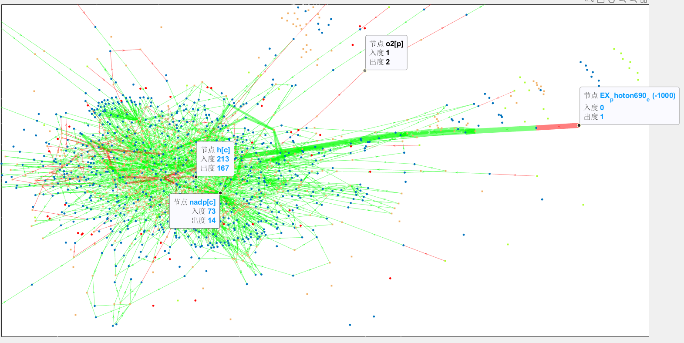

### Content
(in case you want)
- [iGEM\_OCE\_2023\_Modeling Logbook](#igem_oce_2023_modeling-logbook)
  - [Things we do](#things-we-do)
    - [1. HCHO-GFP hill-equation fit](#1-hcho-gfp-hill-equation-fit)
    - [2. FBA(Flux Balance analysis)](#2-fbaflux-balance-analysis)
      - [What can it do](#what-can-it-do)
      - [Where we are right now](#where-we-are-right-now)
      - [Visualization with COBRA](#visualization-with-cobra)
  - [Toys we use](#toys-we-use)
    - [Language](#language)
    - [Some useful things](#some-useful-things)
  - [Reference](#reference)

# iGEM_OCE_2023_Modeling Logbook

## Things we do

### 1. HCHO-GFP hill-equation fit

Well done.

### 2. FBA(Flux Balance analysis)

URGHHHHHHHHHHHHHHHHHH.

We basically figured something out.

#### What can it do

First, FBA **is** able to simulate:

1. the growth rate (even multiple species) in certain constraint.
2. the metabolites flux in certain constraint.
3. plot the metabolites flux.

#### Where we are right now

We are trying to use COBRA to simulate the algae's sucrose production.

However, there are some problems:

1. the result said the cell does not taken Na+ from outside.
2. sucrose production pathway is shut down.

For problem 1, we have not find a proper explanation. But for problem 2, there are some ideas.

When we add the sucrose transport reaction into the model and run the algorithm, the sucrose\[e\], or the extracellular sucrose flux is 0. Thus, we trace back to its reactant, and found that the sucrose synthesis pathway does not activate, the reaction SPP, SPS does not have any flux through it.

However, the substance f6p and udpg is actively participating in other biochemical pathways. So, there one possible here, which we are working on.

~~**The gene bound to the reaction is not activated.**~~ - Might not true. 2023.08.25

We hope we are on a right way. Here are the updated informations.

So, the gene bound to SPS, SPP is SYNPCC7942_RS04180, and we want to know in what circumstances, the gene will be activated, especially how it works in COBRA.  - 2023.08.24

However, after the removal of gene-reaction rules of SPS/SPP, the flux is still 0.

Funny enough though, by changing the object of the model, the flux of the SPP burst to a few hundred, which surprises me. But the problem still have, the flux through transportation reaction is still 0, all the sucrose are hydrolized into frucose and glucose.

#### Visualization with COBRA

Unlukily, the function draw_by_rxn() in COBRA visualization part [**paint4Net**](https://github.com/opencobra/COBRA.tutorials/tree/d2c66d011568ab6926f23957fbd628a614796e54/visualization/paint4Net) does not work well in 2022b, for the biograph structure is removed. However, in 2022a, although the function is runnable, it does not work well when the graph is too large.

So we made some modification on the draw_by_rxn, switched the structure from *biograph* to *digraph(directioned graph)* and all related function called by the 'draw_by_rxn()'. Here is the result.

If reduce the nodes and edges by focusing on the interested path, we can label the edges and nodes on the panel, no need to guess and click.

By the way, this is the graph of the optimized sucrose production factory, but fail to transport sugar out, LOL.

## Toys we use

### Language

R: statistic processing, plotting.

Python: data processing, especially work with Excel worksheet from wet lab.

Matlab: FBA, mainly because COBRA toolkit\[1\] worked well in Matlab.

### Some useful things

ChatGPT: given some support on how to use ggplot in R to plot.

BiGG: biochemical database, work well with COBRA.

## Reference

\[1\] Laurent Heirendt, Sylvain Arreckx, Thomas Pfau, Sebastian N. Mendoza, Anne Richelle, Almut Heinken, Hulda S. Haraldsdottir, Jacek Wachowiak, Sarah M. Keating, Vanja Vlasov, Stefania Magnusdottir, Chiam Yu Ng, German Preciat, Alise Zagare, Siu H.J. Chan, Maike K. Aurich, Catherine M. Clancy, Jennifer Modamio, John T. Sauls, Alberto Noronha, Aarash Bordbar, Benjamin Cousins, Diana C. El Assal, Luis V. Valcarcel, Inigo Apaolaza, Susan Ghaderi, Masoud Ahookhosh, Marouen Ben Guebila, Andrejs Kostromins, Nicolas Sompairac, Hoai M. Le, Ding Ma, Yuekai Sun, Lin Wang, James T. Yurkovich, Miguel A.P. Oliveira, Phan T. Vuong, Lemmer P. El Assal, Inna Kuperstein, Andrei Zinovyev, H. Scott Hinton, William A. Bryant, Francisco J. Aragon Artacho, Francisco J. Planes, Egils Stalidzans, Alejandro Maass, Santosh Vempala, Michael Hucka, Michael A. Saunders, Costas D. Maranas, Nathan E. Lewis, Thomas Sauter, Bernhard Ø. Palsson, Ines Thiele, Ronan M.T. Fleming, Creation and analysis of biochemical constraint-based models: the COBRA Toolbox v3.0, Nature Protocols, volume 14, pages 639–702, 2019 doi.org/10.1038/s41596-018-0098-2.
