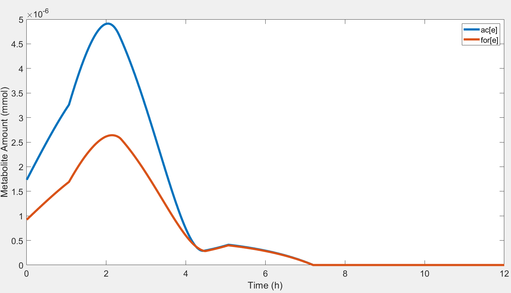
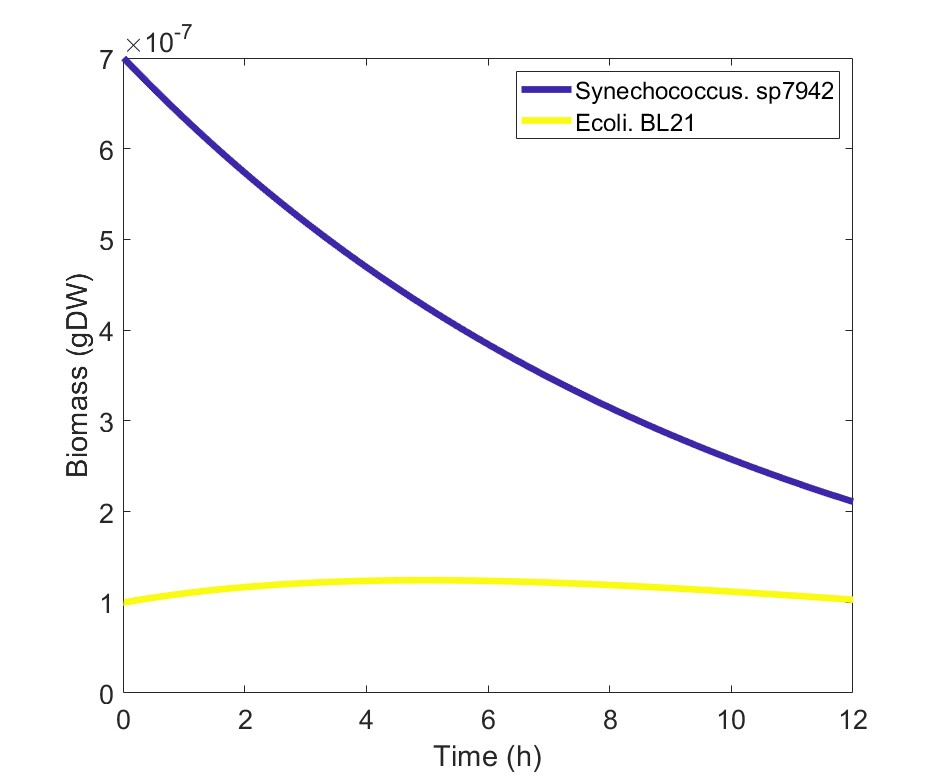
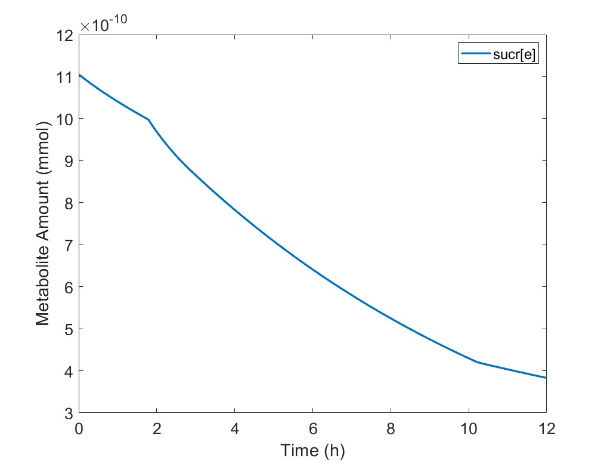
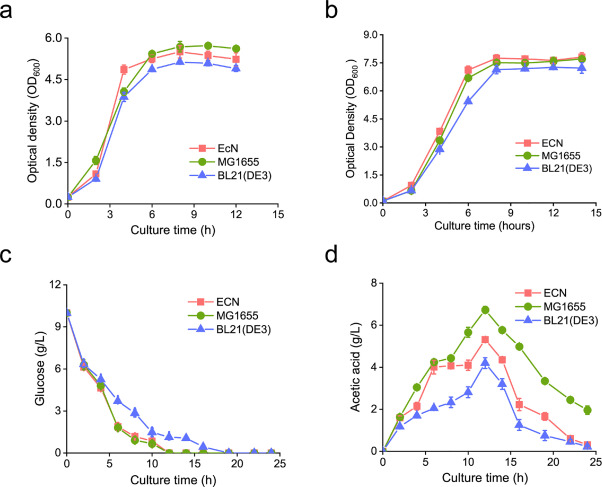
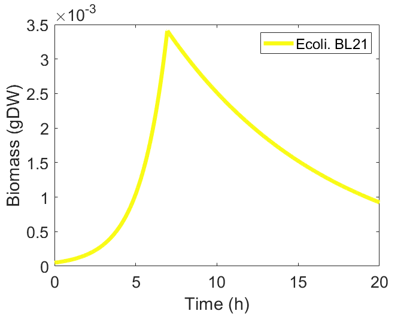
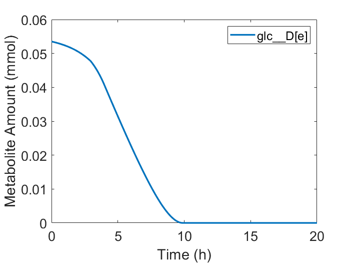

### Content
(in case you want)
- [iGEM\_OCE\_2023\_Modeling Logbook](#igem_oce_2023_modeling-logbook)
  - [Notice](#notice)
  - [Timeline](#timeline)
    - [1. HCHO-GFP hill-equation fit](#1-hcho-gfp-hill-equation-fit)
    - [2. FBA(Flux Balance analysis)](#2-fbaflux-balance-analysis)
      - [What can it do](#what-can-it-do)
      - [Where we are right now](#where-we-are-right-now)
      - [Visualization with COBRA](#visualization-with-cobra)
      - [What we should do when applying FBA into our research](#what-we-should-do-when-applying-fba-into-our-research)
      - [build co-culture with COMET - 2023/08/30](#build-co-culture-with-comet---20230830)
      - [build co-culture with COMET - 2023/08/31](#build-co-culture-with-comet---20230831)
      - [dying, dying, and dying algae](#dying-dying-and-dying-algae)
      - [Stuck here? No - 2023/09/04](#stuck-here-no---20230904)
      - [Verify, adjust - 2023/09/06](#verify-adjust---20230906)
    - [Algorithm based on COMETs](#algorithm-based-on-comets)
  - [Toys we use](#toys-we-use)
    - [Language](#language)
    - [Toolkits](#toolkits)
    - [Some useful things](#some-useful-things)
  - [Reference](#reference)

# iGEM_OCE_2023_Modeling Logbook

## Notice

This is the logbook of Modeling group. If you want to check the updated **result**, refer to **README.md** or just enter our [github website homepage](https://github.com/etherealgemini/OCE_iGEM_Modeling) and scroll down.

Most of things here are something won't appear at the wiki, because here are filled with trial and error, like any other lab work.

**Shout out to team [ShanghaiTech-China](https://2022.igem.wiki/shanghaitech-china/model#1).**

## Timeline

### 1. HCHO-GFP hill-equation fit

Well done.

### 2. FBA(Flux Balance analysis)

URGHHHHHHHHHHHHHHHHHH.

We basically figured something out.

#### What can it do

First, FBA **is** able to simulate:

1. the growth rate (even multiple species) in certain constraint.
2. the metabolites flux in certain constraint.
3. plot the metabolites flux.

#### Where we are right now

We are trying to use COBRA to simulate the algae's sucrose production.

However, there are some problems:

1. the result said the cell does not taken Na+ from outside.
2. sucrose production pathway is shut down.

For problem 1, we have not find a proper explanation. But for problem 2, there are some ideas.

When we add the sucrose transport reaction into the model and run the algorithm, the sucrose\[e\], or the extracellular sucrose flux is 0. Thus, we trace back to its reactant, and found that the sucrose synthesis pathway does not activate, the reaction SPP, SPS does not have any flux through it.

However, the substance f6p and udpg is actively participating in other biochemical pathways. So, there one possible here, which we are working on.

~~**The gene bound to the reaction is not activated.**~~ - Might not true. 2023.08.25

We hope we are on a right way. Here are the updated informations.

So, the gene bound to SPS, SPP is SYNPCC7942_RS04180, and we want to know in what circumstances, the gene will be activated, especially how it works in COBRA.  - 2023.08.24

However, after the removal of gene-reaction rules of SPS/SPP, the flux is still 0.

Funny enough though, by changing the object of the model, the flux of the SPP burst to a few hundred, which surprises me. But the problem still have, the flux through transportation reaction is still 0, all the sucrose are hydrolized into frucose and glucose.

#### Visualization with COBRA

The motivation of visualizing the metabolite network is trying to do some trouble-shooting.

Unlukily, the function draw_by_rxn() in COBRA visualization part [**paint4Net**](https://github.com/opencobra/COBRA.tutorials/tree/d2c66d011568ab6926f23957fbd628a614796e54/visualization/paint4Net) does not work well in 2022b, for the biograph structure is removed. However, in 2022a, although the function is runnable, it does not work well when the graph is too large.

So we made some modification on the draw_by_rxn, switched the structure from *biograph* to *digraph(directioned graph)* and all related function called by the 'draw_by_rxn()'. Here is the result.

If reduce the nodes and edges by focusing on the interested path, we can label the edges and nodes on the panel, no need to guess and click.

By the way, this is the graph of the optimized sucrose production factory, but fail to transport sugar out, LOL. - 2023.08.26

#### What we should do when applying FBA into our research

This is quite important, and I missed this part at first.

Basically, we will :

1. Verify the Genome-Scale Metabolic Models(GEM) first. Because no one knows why out model worked and how accurate it is.
2. Try simulate close to real case, like the carbon source, co-culture and other constraint.
3. Simulate dynamically, or trace the change of biomass and interested metabolites such as HCHO and NH$_3$ over time, which will be verified or verify the result from wet lab.
4. Guide the hardware build, which might be the ultimate goal. Try to get the optimal ratio of different component and check the robustness of the entire system.

#### build co-culture with COMET - 2023/08/30

I would like to show how powerful it can be at first. 

**NOTICE: This two graph comes from the code in the tutorial of COMETs**

The algorithm will simulate an *in silicon* environment, the reaction inside each model, matter transport and cell growth and death. So, yes, it can simulate the dynamic of the whole system and allow trace on any metabolites\species.

If you want, it can simulate something cooler, but might not need in our project. Check the [COMETs example](https://www.runcomets.org/examples) website here!

We are currently build a community now, with a sucrose factory, a HCHO processor, and a sucrose processor, or an algae and two different e.coli.

Theoretically, it should be easy and direct, but due to some unknown problem, the tool does not work well with my model.

We thought the problems might be the different name of the same metabolite, for example, glc__D\[e\](COBRA) and glc-D\[e\](COMET), which will possibly affect the reactions(or process). Ughhhhhhhh, I hate the inconsistence between tools. - 2023/08/30

#### build co-culture with COMET - 2023/08/31

We fix the problem of inconsistence, and yes, '-' and '__' is the problem. But now algae does not absorb photon, and just freedom dying, omg.

After some debug, the system worked barely fine. Here is the result.

Now we are trying to figure out why algae is just dying.

#### dying, dying, and dying algae

Yes, it is just dying.

Here are some possibilities:

1. the BIOMASS reaction is just does not have any flux over it.
2. it has, but too small.
   
I'm curious about the flux over the BIOMASS reaction.

#### Stuck here? No - 2023/09/04

Uh, yeah. Something went wrong with that model, and I cannot find why. I will not stop trying, but we definitely need another way to bypass that.

We will not simulate the co-culture system with algae, but only the sucrose digest part and formaldehyde digest part, and add sucrose as a nutrient.

To make sure the result is real, we will refresh the amount of sucrose in a certain value, so that we can check how much sucrose production rate is necessary for a stable system.

I know this cannot simulate the hidden effect of algae, but we still need a plan B.

#### Verify, adjust - 2023/09/06

So we adjust the glucose intake rate and death rate based on a paper, with a consistent unit. BL21 grew in minimal salt medium with 10 g/L glucose as a carbon source.

Our result:

 

notice that we adjust the unit to fit in the algorithm:

1. initial glucose concentration: 10g/L -> 10mg/ml -> 5.5506E-2 mmol/ml
2. initial population: 0.125 OD600 ~> 1.21475\*10^7 CFU/ml ~> 1.21475\*10^(-5) gDW/ml (gram dry weight)

### Algorithm based on COMETs

## Toys we use

### Language

R: statistic processing, plotting.

Python: data processing, especially work with Excel worksheet from wet lab.

Matlab: FBA, mainly because COBRA toolkit\[1\] worked well in Matlab.

### Toolkits

Gurobi: an industrial optimizer.

COBRA: a FBA toolkit, serve various pre-packaged analysis tools, including model manufacture, FBA, rubust analysis and so forth.

COMET: based on COBRA and Gurobi, a powerful community-dynamic-FBA toolkit, amazing.

ggplot2: a basic plotting tools in Python and R.

### Some useful things

ChatGPT: given some support on how to use ggplot in R to plot.

BiGG: biochemical database, work well with COBRA.

## Reference

\[1\] Laurent Heirendt, Sylvain Arreckx, Thomas Pfau, Sebastian N. Mendoza, Anne Richelle, Almut Heinken, Hulda S. Haraldsdottir, Jacek Wachowiak, Sarah M. Keating, Vanja Vlasov, Stefania Magnusdottir, Chiam Yu Ng, German Preciat, Alise Zagare, Siu H.J. Chan, Maike K. Aurich, Catherine M. Clancy, Jennifer Modamio, John T. Sauls, Alberto Noronha, Aarash Bordbar, Benjamin Cousins, Diana C. El Assal, Luis V. Valcarcel, Inigo Apaolaza, Susan Ghaderi, Masoud Ahookhosh, Marouen Ben Guebila, Andrejs Kostromins, Nicolas Sompairac, Hoai M. Le, Ding Ma, Yuekai Sun, Lin Wang, James T. Yurkovich, Miguel A.P. Oliveira, Phan T. Vuong, Lemmer P. El Assal, Inna Kuperstein, Andrei Zinovyev, H. Scott Hinton, William A. Bryant, Francisco J. Aragon Artacho, Francisco J. Planes, Egils Stalidzans, Alejandro Maass, Santosh Vempala, Michael Hucka, Michael A. Saunders, Costas D. Maranas, Nathan E. Lewis, Thomas Sauter, Bernhard Ø. Palsson, Ines Thiele, Ronan M.T. Fleming, Creation and analysis of biochemical constraint-based models: the COBRA Toolbox v3.0, Nature Protocols, volume 14, pages 639–702, 2019 doi.org/10.1038/s41596-018-0098-2.
