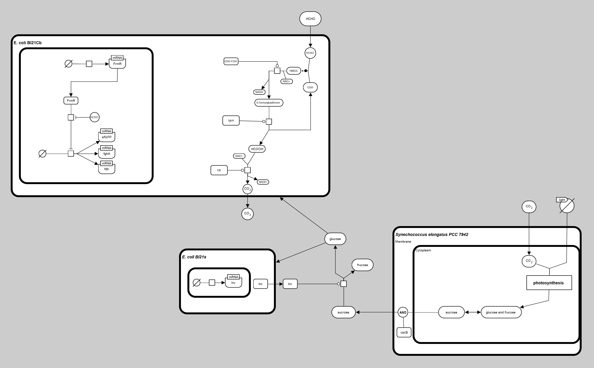
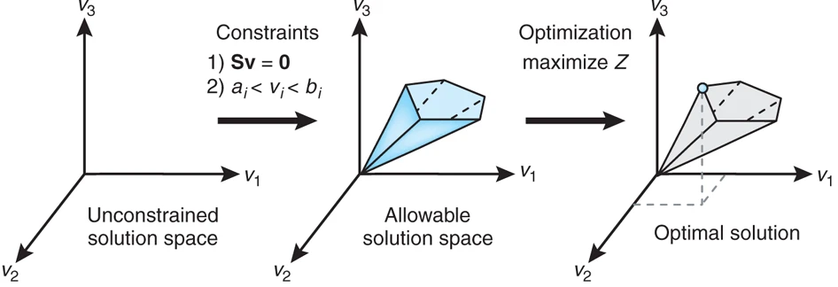
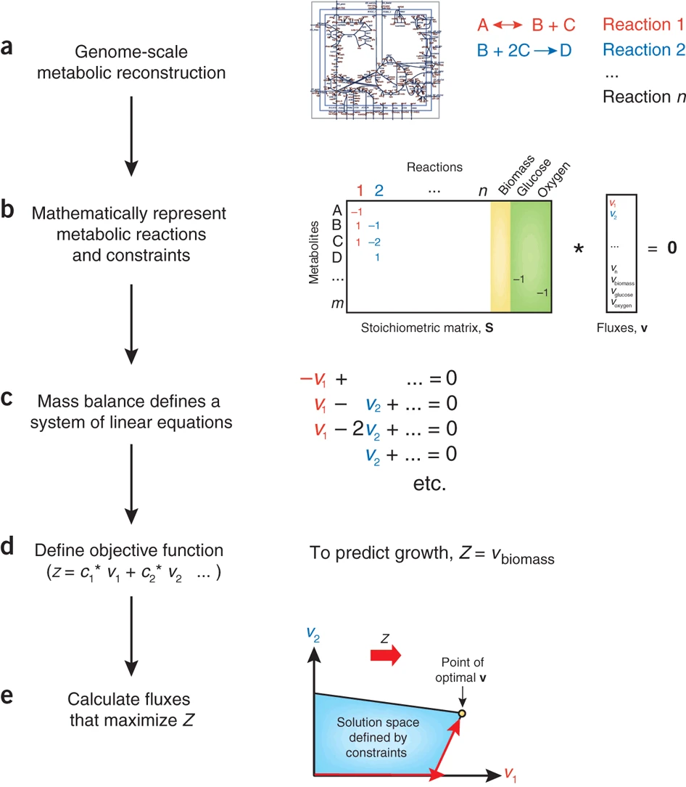

# OCE_iGEM_Modeling

[![CC BY 4.0][cc-by-shield]][cc-by]

This work is licensed under a
[Creative Commons Attribution 4.0 International License][cc-by].

[![CC BY 4.0][cc-by-image]][cc-by]

[cc-by]: http://creativecommons.org/licenses/by/4.0/
[cc-by-image]: https://i.creativecommons.org/l/by/4.0/88x31.png
[cc-by-shield]: https://img.shields.io/badge/License-CC%20BY%204.0-lightgrey.svg

## 0. Introduction

### About the repository

0. Refer to [iGEM's description of *Best Model Prize* in iGEM](https://2023.igem.wiki/example/model) to have a general impression.
1. The repository is NOT cleaned up yet, since time is swallowed by courses. Sorry for that.
2. Refer to [the Model part of our team wiki](https://2023.igem.wiki/sustech-oce/model) for final detailed version of the project.
3. We may only introduce some key part here, check PDFs in [./Logbook](https://github.com/etherealgemini/OCE_iGEM_Modeling/tree/main/Logbook) for detailed explanation for some of the works.

### About the pathway illustration

We follows a standard named [Systems Biology Graphical Notation(SBGN)](https://sbgn.github.io/) to draw the pathway illustration.

### About the data

Yes, all data are open-sourced. Check the "./RawData" directory.

### About questions

If you have any questions about our project, you may **open an issue** and illustrate your question in detail. I am not really familiar with all the math behind the method, so do not expect too much on this.
I can find some sources referred to maybe.

## 1. FBA (Flux Balance Analysis)

When considering the analysis of metabolites flows on a metabolic network, FBA is a common and useful mathematics tool. Basically, FBA is trying to solve a **constraint-based optimization problem**.

You can refer to [this paper](https://www.nature.com/articles/nbt.1614), which introduces the definition of FBA and the mathematics behind it, especially the Figure 1 and Figure 2 which are posted here.

    
     
    
With no constraints, the flux distribution of a biological network may lie at any point in a solution space. When mass balance constraints imposed by the stoichiometric matrix S (labeled 1) and capacity constraints imposed by the lower and upper bounds (ai and bi) (labeled 2) are applied to a network, it defines an allowable solution space. The network may acquire any flux distribution within this space, but points outside this space are denied by the constraints. Through optimization of an objective function, FBA can identify a single optimal flux distribution that lies on the edge of the allowable solution space. (Orth et al., 2010)

.

    
     
    
(Orth et al., 2010)

### COBRA Toolbox

The toolbox [COBRA](https://opencobra.github.io/cobratoolbox/latest/index.html) mentioned in the paper is usefull in implementation. We choose MATLAB version, though Python version is available as well.

### BiGG database

[BiGG database](http://bigg.ucsd.edu/) played an important role in providing well constructed model in a friendly format for COBRA.

## FEM (Finite Element Method)

This is a numeric method widely used in simulation. The key idea of it is to divide **continueous bodies** into **discret small mesh of simple parts**, or elements. Refer to [wiki in Brilliant](https://brilliant.org/wiki/finite-elements/) for a better, rough understanding. Notice that the implementation of FEM is highly related to the problem's definition, so further research in the implementation in specific fields may be necessary.

We use MATLAB to finish the modeling and solving.

## Things We learned

### Clarify the problem

A clear definition of problem is one of the parts in the first step of modeling. Make sure what is the problem to solve, then there is a direction for research.

### Talk to others in group

Make sure everyone is actively engaged in the project and know what are others doing, which will prevent work on the same thing or something is missing due to lack of communication.

### Talk to other groups

One of the requirements of [best model in iGEM](https://2023.igem.wiki/example/model) is about the special contributions of model to the whole project.

What's more, communicate with other groups may help them strengthen the relation of their work with yours.

### Cite everything

This will not only prevent a plagiarism issue, but also support the results with solid sources.

If you use any tool, conclusion, data that are not originated from you, cite it in correct format, APA 7th for example.

### Great example

[Lund University Biological System course note](http://home.thep.lu.se/~henrik/tek292/lectureNotes.pdf): good start point for newcomer in system biology

[Toulouse_INSA-UPS, Best model nomination](https://2021.igem.org/Team:Toulouse_INSA-UPS/Model): inspired us of the usage of FBA

## Reference

Orth, J., Thiele, I. & Palsson, B. What is flux balance analysis?. Nat Biotechnol 28, 245–248 (2010). https://doi.org/10.1038/nbt.1614
