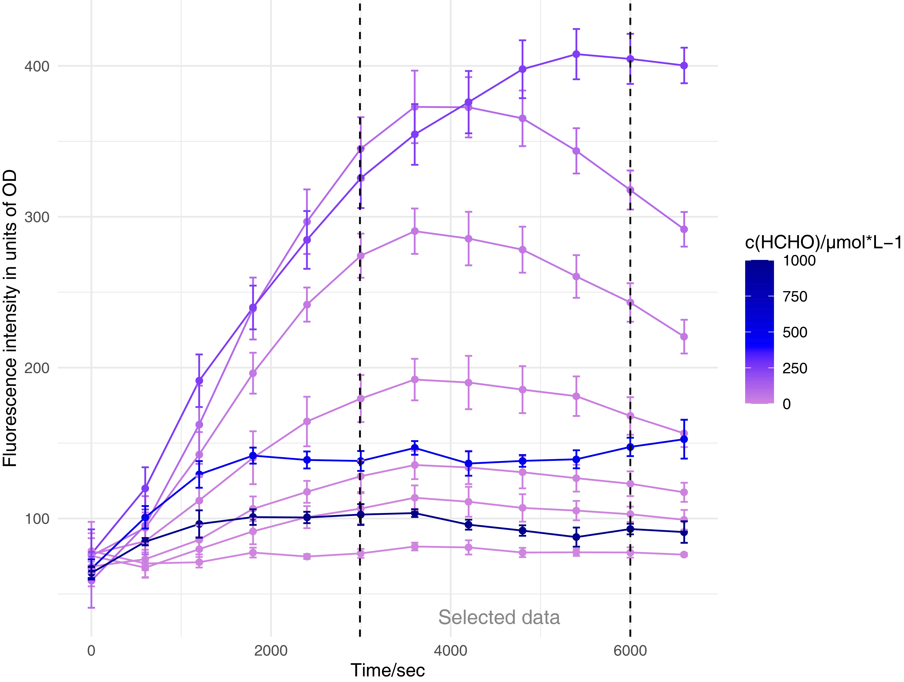
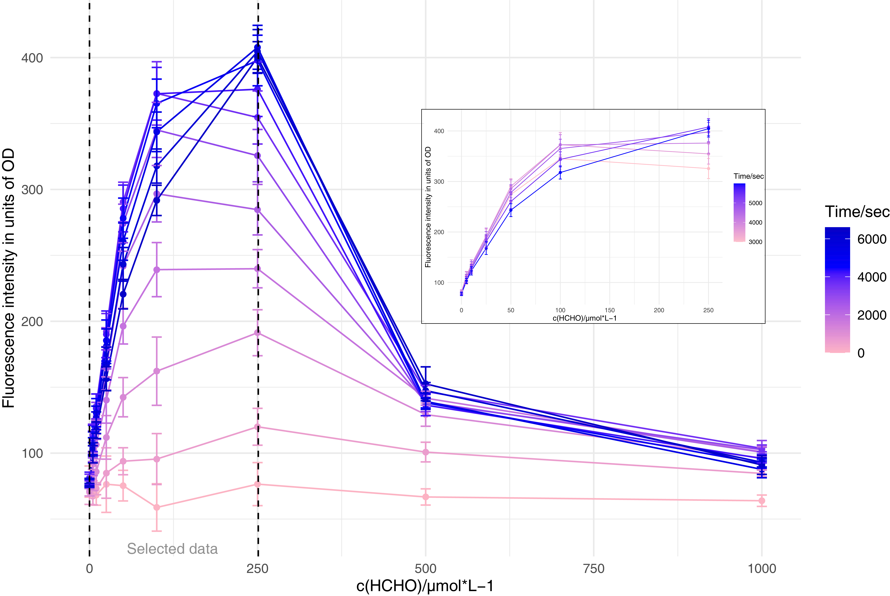
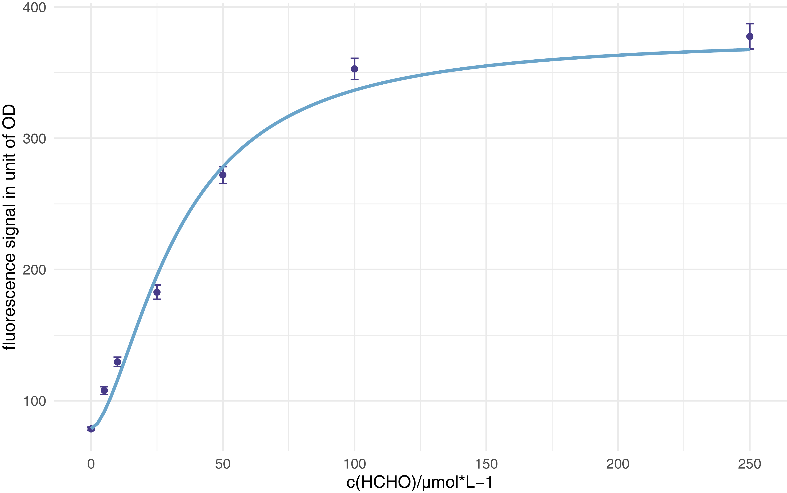

# OCE_iGEM_Modeling

## What is this

This is the modeling part of our iGEM project. The whole project is ongoing right now, stay tuned.

This repo is only for recording and for fun.

## Where we are right now

Now, we have finished some part and are working on several things. Check out the TODO list!

## TODO

1. Draw the path of whole project, including the chemical reaction and gene regulation.
2. Modeling the formaldehyde operon and the related formaldehyde degradation process.
3. Modeling the formaldehyde sensor part.
4. Modeling the algae/e.coli coculture system.
5. Modeling the hardware.

### Task 1: path

This will go through the whole project. And this is what we have done now.

### Task 2: Modeling of HCHO operon/degradation

Ongoing.

### Task 3: Modeling of the HCHO sensor

Here are the results.

 

Generally speaking, we select the data that are collected:

1. after some time such that the system is stable.
2. at the concentration of HCHO will not disable the sensor(e.coli).

Then we use the processed data to fit to the equation:

$S=S_{min}+(S_{max}-S_{min})\times\frac{[F]^n}{K_m^n+[F]^n}$

and here is the result:

| Parameters | Estimate | Std. error | t value | P                |
|------------|----------|------------|---------|------------------|
| K_m        | 32.7494  | 2.5972     | 12.609   | 5.57e-05 *** |
| n          | 1.6467   | 0.1996     | 8.249    | 4.27e-04 ***  |

### Task 4: coculture system

Well, a bit hard.

This may be split into some sub-tasks.

1. Modeling the photosynthesis part, which responsible for sucrose production.
2. Modeling the transformation of sucrose to glucose/fructose.
3. Modeling the the growth of the culture.

## Some method

### ODE

A classic way of describing a model's behaviour.

### FBA(Flux balance analysis)

#### What is FBA?

FBA is a methametical method to study the behaviour of biochemical networks. It can reveal the flow of metabolites *in silico*, for example, the growth rate of *E. coli* in high $\text{Na}^+$ concentration 
environment.

#### Promotion

ODE is powerful, but sometimes complex and less accurate, for the simplify of the system. To gain a more accurate result, we want to give FBA a shot.

#### Goals

1. Simulate the sucrose production rate of algae.
2. Simulate the growth rate of E. coli, without algae.
3. Get the optimal ratio of different components in co-culture system.
4. Add more constraint, push it to the real case.
